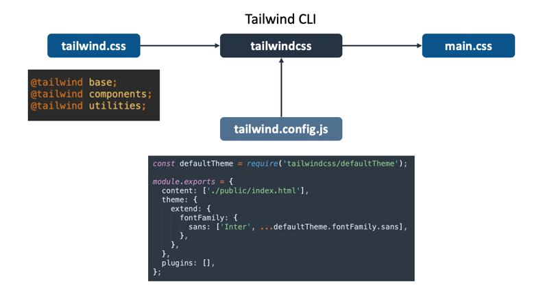

# Tailwind CSS Build Pipeline

Visual explanation of the Tailwind CSS build pipeline.

## Using Tailwind CLI

The CLI pulls in only those classes that are used in the content (in this case
index.html).

## Using PostCSS

The tailwindcss plugin pulls in only those classes that are used in the content
(in this case index.html).

